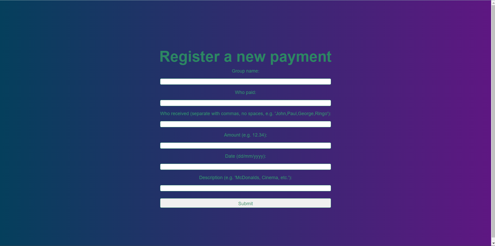
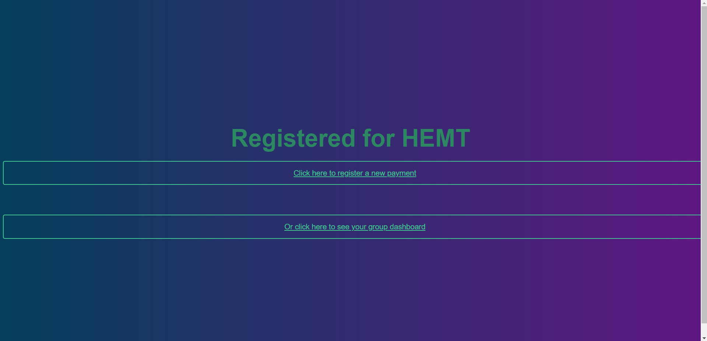
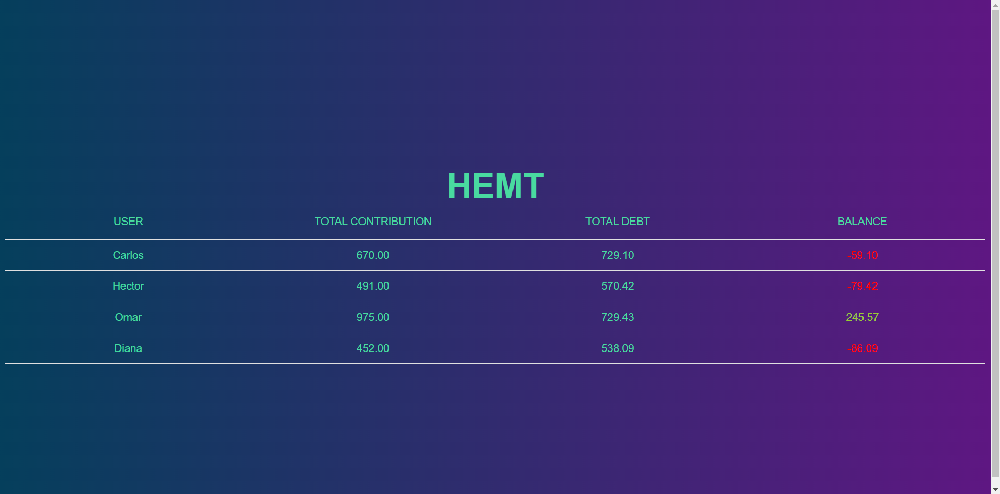

# SimpleDebt
Welcome to the SimpleDebt project! SimpleDebt is a platform that makes it easy for you to keep track of payments between friends. It's perfect for keeping track of group expenses, such as those incurred when going out to eat or having a night out.

## Images
### Register a payment

### Payment registered

### Balance dashboard

## Features
- Register users and form groups
- Register payments
- Calculate individual debt for each payment
- Calculate the balance of each user
- Display the results in a table

## Built With
- [Python 3.8](https://www.python.org/downloads/release/python-380/) - The programming language used
- [Django 4.1.3](https://www.djangoproject.com/) - The web framework used
- [Pandas 1.4.2](https://pandas.pydata.org/) - The prototype data reader used

Or see the [requirements.txt](./requirements.txt) file for more details.

## Acknowledgments
- Inspired by [Splitwise](https://www.splitwise.com/)